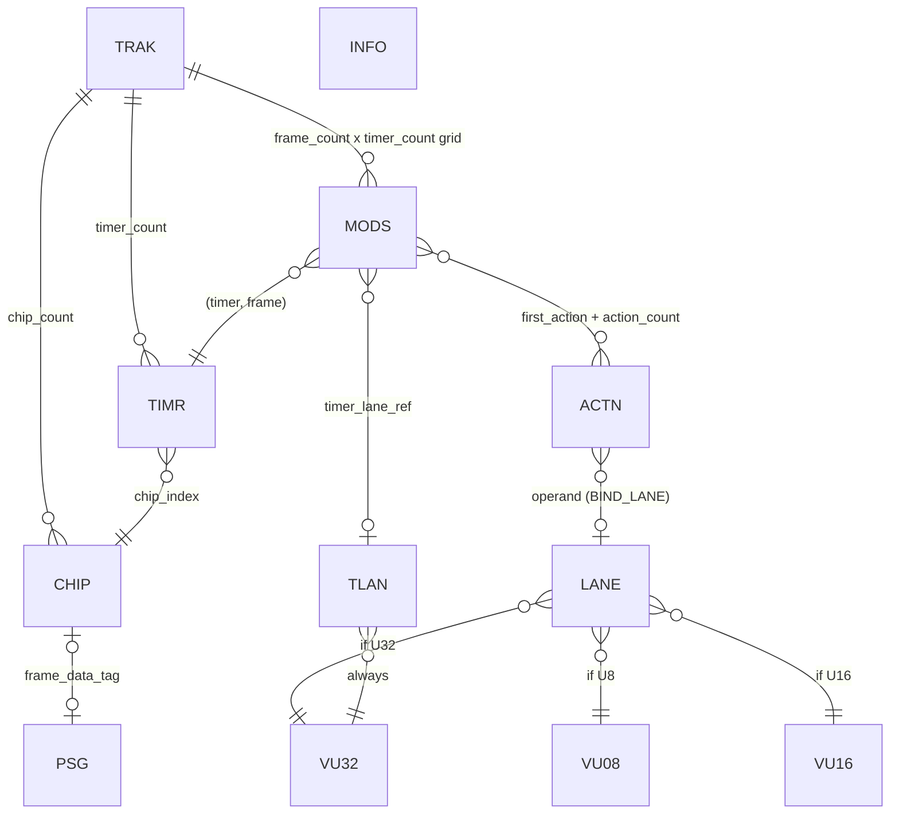

# TAYM in a nutshell

An informal tour of the TAYM format. The normative spec is
[`TAYM-format-draft-0.1.md`](TAYM-format-draft-0.1.md) -- read that when you
actually implement a reader. This is the mental model.

## What it's for

TAYM (**Timer-tricks AY-3-8910 Music**, though the format is chip-agnostic) is a
**chip-music interchange format**. A tracker or synth tool (Bitphase,
Chipnomad, ...) exports TAYM; a per-platform converter turns it into whatever
the target machine actually plays. It is *not* meant to be played directly --
think "source of truth you compile from," not "runtime format." The name
references the AY-3-8910, but the format targets any retro music chip (SID,
OPL, SN76489, ...) where timer-trick techniques apply.

Design bias: a plain C reader on a 16-bit box should cope. So everything is
little-endian, byte-packed, fixed-size records, and **indices instead of
pointers**. No schema language, no objects to rebuild after load.

## The big idea: frame stream + timers

Two things run on one shared frame timeline (e.g. 50 Hz):

1. **Frame data** -- the bulk register dump for each chip, one frame at a time.
   For AY this is literally a standard Bulba `.psg` file dropped in unchanged.
   This is your "notes and slow stuff."

2. **Timers** -- fast scheduler instances that fire *between* frames, much
   faster than the frame rate, to do the things `.psg` can't: PWM, duty sweeps,
   envelope retriggers, sample playback. A timer **owns** a set of chip
   registers (targets) and overrides the frame stream for them while active.

So: slow movement lives in the frame stream; fast per-tick movement lives in
timers. Two timescales, cleanly split.

## Lanes: shared, looping value sequences

A **lane** is just an array of values with a loop point. It has no target on its
own -- it's anonymous timbre data. You *bind* a lane to a target in an action,
so one lane (say duty `[15, 0]`) can be reused by many voices.

There are two lane tables:

- **value lanes** (`LANE`) -- drive register values; can be u8/u16/u32.
- **timer lanes** (`TLAN`) -- drive the *interval* between timer ticks; either
  absolute rates/periods or a multiplier on a base rate.

Each binding steps its lane independently: a volume lane and a pitch lane on the
same timer can have different lengths and loops.

## A timer tick, conceptually

```
START:  write each target's value 0, load interval 0, wait
expiry: advance every lane one step, write new values, load new interval, wait
        ... repeat ...
```

Lane endings matter:
- a **no-loop value lane** writes its last value once then goes *dormant* (stops
  rewriting -- important for write-sensitive regs like AY R13).
- a **no-loop timer lane** runs its last interval then goes *quiescent* (timer
  stops firing but still owns its targets until a STOP).

## How timers change over time: MODS

`MODS` is a giant fixed array, one record per `(timer, frame)`. Each record is
one of four commands:

- `EMPTY` -- nothing changes this frame (most records).
- `START` -- (re)claim a target set, reset lanes to 0, retrigger.
- `MODULATE` -- patch the running state (new base, swap a lane) **without**
  retriggering. Preserves lane phase.
- `STOP` -- release targets, hand them back to the frame stream.

It's mostly `EMPTY` and can be ~1 MB for a long track -- that's deliberate, it
buys O(1) random access to any frame with zero decompression.

## Targets

A target is what an action writes. Target IDs are chip-local, 8-bit, split:

```
0x00..0x7F  real hardware registers (AY R0..R13 -- see appendix A of the spec)
0x80..0xBF  format-defined virtual: reserved in draft 0.1 (future samples)
0xC0..0xFF  engine-private virtual targets (per chip type)
```

The format-virtual range is where future sample/wavetable targets will live,
but draft 0.1 defines none -- it's reserved. (There's no sample store: samples
are just lane data written at the timer rate, so pitch is the timer interval.)

## File layout at a glance

Fixed 16-byte header, then tagged chunks (RIFF-style: 4-char tag + size +
payload). Walk the headers once, then every payload is a flat array you can
memory-map or `memcpy` into packed structs.

```
header
TRAK    one record: frame rate, frame count, loop point, chip/timer counts
INFO    optional UTF-8 key=value metadata
CHIP    chip instances (type id, clock, name, frame-data tag)
TIMR    timer defs (which chip, clock mode/divider)
MODS    the (timer x frame) command grid
ACTN    actions (target <- inline value or lane)
LANE    value-lane descriptors
TLAN    timer-lane descriptors
VU08/VU16/VU32   flat scalar pools that lanes slice into
PSG0/PSG1/...    embedded .psg frame data (or external sidecar files)
```

Cross-references are all integer indices into these arrays. No pointers.

## What references what



`PSG` stands for the per-chip frame-data chunk (`PSG0`, `PSG1`, ...). `INFO` is
standalone -- nothing references it. Every edge is an integer index (or a chunk
tag, for `frame_data_tag`), never a pointer.

## Every record and field

Sizes in bytes. `u8/u16/u32` are little-endian. `16.16` = unsigned 16.16 fixed
point. `resv` must be zero.

**File header (16)**
```
magic        4   "TAYM"
version      2   u16 = 1
header_size  2   u16 = 16
flags        4   u32 = 0
chunk_bytes  4   u32  exact size of the chunk stream
```

**Chunk header (8)**, before every chunk's payload
```
tag          4   four ASCII uppercase letters or digits
size         4   u32  payload bytes (excludes this header)
```

**TRAK (16)** -- exactly one record
```
frame_rate   4   u32 16.16 Hz, nonzero
frame_count  4   u32 nonzero
loop_frame   4   u32 frame index, or 0xFFFFFFFF = no loop
chip_count   1   u8
timer_count  1   u8
resv         2
```

**CHIP (32)** -- chip_count records
```
clock_hz        4   u32 master clock in Hz
chip_type_id    1   u8  (AY = 0x01)
variant         1   u8  behavioral pick within type (AY: 0=AY, 1=YM DAC curve)
resv            2
name           16   ASCII, NUL-padded
frame_data_tag  4   chunk tag, or 4 zero bytes
config          4   u32 chip-type-private bitfield (AY: bits 0..2 stereo layout)
```

**TIMR (6)** -- timer_count records
```
clock_divider  2   u16  (0 for ABS_RATE_HZ, nonzero for CHIP_PERIOD)
chip_index     1   u8   index into CHIP
clock_mode     1   u8   0 ABS_RATE_HZ, 1 CHIP_PERIOD
resv           2
```

**MODS (16)** -- frame_count * timer_count records,
index = frame * timer_count + timer
```
base_timer_value  4   u32  (0 = unchanged in MODULATE)
timer_lane_ref    4   u32  TLAN index, 0xFFFFFFFF NONE, 0xFFFFFFFE UNCHANGED
first_action      4   u32  index into ACTN
action_count      1   u8
command           1   u8   0 EMPTY, 1 START, 2 MODULATE, 3 STOP
resv              2
```
(for EMPTY/STOP the first four fields are ignored -- a canonical writer zeroes
them; only `resv` is validated as zero)

**ACTN (6)** -- one per (target <- source) binding
```
operand        4   u32  inline scalar, or LANE index
target_id      1   u8   chip-local target
source_mode    1   u8   0 INLINE_VALUE, 1 BIND_LANE
```

**LANE (16)** -- value-lane descriptors
```
value_offset   4   u32  element index into the pool
length         4   u32  nonzero
loop_index     4   u32  lane-relative, or 0xFFFFFFFF = no loop
value_type     1   u8   1 U8->VU08, 2 U16->VU16, 3 U32->VU32
resv           3
```

**TLAN (16)** -- timer-lane descriptors (always over VU32)
```
value_offset   4   u32  element index into VU32
length         4   u32  nonzero
loop_index     4   u32  lane-relative, or 0xFFFFFFFF = no loop
timing_mode    1   u8   0 ABSOLUTE, 1 RELATIVE
resv           3
```

**VU08 / VU16 / VU32** -- flat pools, no record; raw u8 / u16 / u32 arrays.
Lane `value_offset` is an *element* index, not a byte offset.

**INFO** -- `key=value\0` pairs, terminated by an extra `\0`. UTF-8, ignorable.

**PSG0/PSG1/...** -- a complete standard Bulba `.psg` (own header + `$FD`
terminator), one per AY chip. Decodes to exactly `frame_count` frames.

## Things that trip people up

- `index 0` is a real, valid index -- the only "null" is `0xFFFFFFFF` (and
  `0xFFFFFFFE` = "unchanged" for a timer-lane ref).
- `MODULATE` is **not** a restart. It never retriggers and never writes a
  register itself; new output shows up at the next expiry.
- the `.psg` stream has no keyframes, so reconstructing full register state at
  the loop point is the *consumer's* job (decode up to the loop frame once).
- everything multibyte is little-endian; reserved fields must be zero.

That's the whole model. For exact byte offsets, validation rules, and the AY
register map, see the spec.
